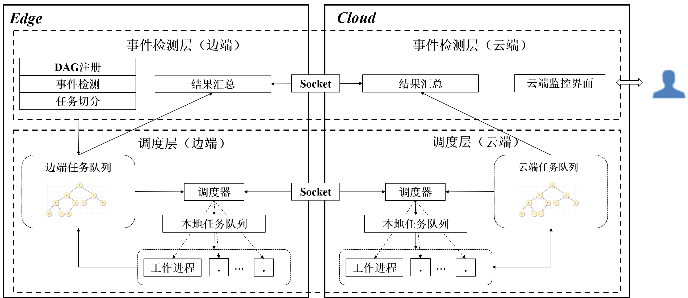

# edge-video-analysis

## 1、DEMO运行方法

边缘端

```shell
$ python3 task_server_protocol.py --port=8888
$ python3 edge.py --side=e --cloud_ip=<cloud_ip> --cloud_port=9999 --task_q_port=8888
```

云端

```shell
$ python3 task_server_protocol.py --port=7777
$ python3 edge.py --side=c --cloud_port=9999 --task_q_port=7777
```

：为啥从web上看，越跑越慢...？

## 1、整体结构

### 1.1、事件检测层与调度层



## 2、任务接口定义

```js
task_workflow_info
{
    "name": 'POSE_ESTIMATION',  // 工作流名称
    "flow": [  // 工作流各步骤索引和先后顺序
        {"name": 'D'},
        {"name": 'C'}
    ],
    "model_ctx": {  // 工作流各步骤所用模型的参数
        "D": {
        },
        "C": {
        }
    },
    "input_ctx": {  // 工作流各步骤输入数据字段标识和顺序
        "D": <ctx_field>,
        "C": <ctx_field>
    },
    "output_ctx": {  // 工作流各步骤输出数据字段标识和顺序
        "D": <ctx_field>,
        "C": <ctx_field>
    }
}


task_queue_protocol
{
    "cmd": "push" | "pull" | "pulled task",  // 提交or拉取任务
    "body": <prior_task>  // 任务结构体
}

prior_task
{
    "prior": 2,  // 任务优先级
    "body": <task>  // 实际可以被worker解析并执行的任务结构体
}

// 任务队列中元素：(prior_task['prior'], prior_task)

task
{
    "id": 2,  // 任务id/DAG图id，一个任务对应一个DAG图
    "t_init": 16384503.2,  // 任务产生时间
    "cur_step": 0 | 1 | ..., // 当前步骤在DAG图中索引（该步骤未执行）
    "task_name": 'D' | 'C' | 'R',  // 当前步骤名称
    "t_end": 16892382.2,  // 任务结束时间
    "input_ctx": <ctx>  // 执行当前步骤所需的输入数据
}

ctx_field
["field1", "field1", ..., "fieldn", ]

ctx
{
    "field1":
    "field2":
    ...
    "fieldn":
}
```

云边通信协议

```js
cloud_protocol
{
    "cmd": "strategy" | "resources" | "task",
    "body": <resources_type> | <prior_task>
}
```